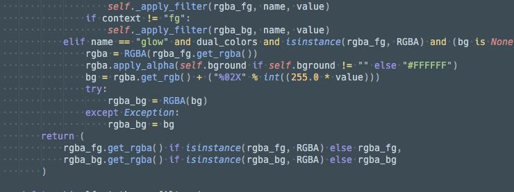

# User Guide

## Overview

In order to use ThemeTweaker, you must set up your desired commands.  Commands can be for the command palette, keymaps, menu etc.  ThemeTweaker comes with an example keymap file to show how commands are constructed.

The default steps, hues, or intensities (depending on the command), are defined in the settings file.  These can be changed if desired.

When tweaking a scheme, the scheme file (plus overrides in Sublime Text builds 3150+) will be consolidated and copied into `User/ThemeTweaker` with the scheme name and the prefix `tweak_`. In Sublime Text 3150+, scheme files will be of the type `.sublime-color-scheme`, while earlier builds will use the file type of `.tmTheme`.

## Filter Commands

### Brightness

`theme_tweaker_brightness`
: 

    Adjust the brightness of theme.

    

    Parameters  | Type   | Description
    ----------- | ------ | -----------
    `direction` | string | Accepts a string that is either `+` or `-` to control whether to go brighter or darker respectively.
    `step`      | float  | Controls the brightness magnitude for each step. It is in relation to the center `1.0`.  So a value of `0.01` would shift it `1.01`.
    `context`   | string | You can limit the filter to the background or foreground by setting the argument to either `bg` or `fg` respectively.
    `theme`     | string | Theme to adjust.  If none, it will use the current set theme.

### Contrast

`theme_tweaker_contrast`
: 

    Adjust the contrast of theme.

    

    Parameters  | Type   | Description
    ----------- | ------ | -----------
    `direction` | string | Accepts a string that is either `+` or `-` to control whether to go brighter or darker respectively.
    `step`      | float  | Controls the contrast magnitude for each step. It is in relation to the center `1.0`.  So a value of `0.01` would shift it `1.01`.
    `context`   | string | You can limit the filter to the background or foreground by setting the argument to either `bg` or `fg` respectively.
    `theme`     | string | Theme to adjust.  If none, it will use the current set theme.

### Saturation

`theme_tweaker_saturation`
: 

    Adjust the brightness of theme.

    

    Parameters  | Type   | Description
    ----------- | ------ | -----------
    `direction` | string | Accepts a string that is either `+` or `-` to control whether to go brighter or darker respectively.
    `step`      | float  | Controls the brightness magnitude for each step. It is in relation to the center `1.0`.  So a value of `0.01` would shift it `1.01`.
    `context`   | string | You can limit the filter to the background or foreground by setting the argument to either `bg` or `fg` respectively.
    `theme`     | string | Theme to adjust.  If none, it will use the current set theme.

### Hue

`theme_tweaker_hue`
: 

    Shift the hue of colors in the theme.

    

    Parameters  | Type    | Description
    ----------- | ------- | -----------
    `direction` | string  | Accepts a string that is either `+` or `-` to control whether to go brighter or darker respectively.
    `step`      | integer | Accepts an integer which represents a degree between `0` and `360` to shift the hue.
    `context`   | string  | You can limit the filter to the background or foreground by setting the argument to either `bg` or `fg` respectively.
    `theme`     | string  | Theme to adjust.  If none, it will use the current set theme.

### Colorize

`theme_tweaker_colorize`
: 

    Applies the given hue to all colors in the theme.

    

    Parameters | Type    | Description
    ---------- | ------- | -----------
    `hue`      | integer | Accepts a hue value that will be applied to all colors.
    `context`  | string  | You can limit the filter to the background or foreground by setting the argument to either `bg` or `fg` respectively.
    `theme`    | string  | Theme to adjust.  If none, it will use the current set theme.

### Invert

`theme_tweaker_invert`
: 

    Command will invert all colors of the theme.

    

    Parameters | Type   | Description
    ---------- | ------ | -----------
    `context`  | string | You can limit the filter to the background or foreground by setting the argument to either `bg` or `fg` respectively.
    `theme`    | string | Theme to adjust.  If none, it will use the current set theme.

### Sepia

`theme_tweaker_sepia`
: 
    Applies a sepia filer to the theme colors.

    

    Parameters | Type   | Description
    ---------- | ------ | -----------
    `context`  | string | You can limit the filter to the background or foreground by setting the argument to either `bg` or `fg` respectively.
    `theme`    | string | Theme to adjust.  If none, it will use the current set theme.

### Grayscale

`theme_tweaker_grayscale`
: 
   Applies a grayscale filter to the theme colors.

   

    Parameters | Type   | Description
    ---------- | ------ | -----------
    `context`  | string | You can limit the filter to the background or foreground by setting the argument to either `bg` or `fg` respectively.
    `theme`    | string | Theme to adjust.  If none, it will use the current set theme.

### Glow

`theme_tweaker_glow`
: 
    Apply a glow filter to foreground colors.

    

    Parameters  | Type   | Description
    ----------- | ------ |------------
    `intensity` | float  | Accepts a floating point glow intensity to determine the strength of the glow.  Glow should be between `0.0` and `1.0`.
    `theme`     | string | Theme to adjust.  If none, it will use the current set theme.

### Custom Filter

`theme_tweaker_custom`
: 
    A command that allows multiple filters to be chained together.  It takes a string with special syntax to apply filters.  All filters that are available under [Filter Commands](#filter-commands) are configurable.  All operations are defined by a single string.

    **Available Filters:**

    - grayscale
    - sepia
    - invert
    - brightness(float)
    - saturation(float)
    - contrast(float)
    - hue(signed integer)
    - colorize(integer)
    - glow(positive float)

    To apply a filter to just the foreground or background, simply add `@fg` or `@bg` to the filter in question.

    **Example:**

    ```javascript
    {
        "keys": ["up"],
        "command": "theme_tweaker_custom",
        "context": [
            {"key": "theme_tweaker"}
        ],
        "args": {
            "filters": "grayscale@fg;sepia;colorize(0);hue(-30);brightness(1.050000)@bg;saturation(0.900000);brightness(0.950000)"
        }
    },
    ```

## Special Commands

### Undo

`theme_tweaker_undo`
: 
    Undo last applied filter.

### Redo

`theme_tweaker_redo`
: 
    Re-apply last reverted filter.

### Clear

`theme_tweaker_clear`
: 
    Clears all applied filters.

### Toggle Theme Tweaker Mode

This command is available in the command palette as `Theme Tweaker: Toggle Tweak Mode`.

`toggle_theme_tweaker_mode`
: 
    Toggles the internal `theme_tweaker` mode flag that can be used as a context for when tweak commands are active.  See [Constructing Commands](#constructing-commands) for more info.

## Constructing Commands

Whether a keymap, command palette, or menu command is desired, the two theme tweaker related required arguments are `command` which is the name of the commands and `args` which is a dictionary of the parameters.

```javascript
{
    "keys": ["up"],
    "command": "theme_tweaker_brightness",
    "args": {
        "direction": "+"
    }
},
```

Theme tweaker can check for the `theme_tweaker` context to control whether a command is active or not.  The `theme_tweaker` context is toggled with the [Toggle Theme Tweaker Mode](#toggle-theme-tweaker-mode) command.

```javascript
{
    "keys": ["up"],
    "command": "theme_tweaker_brightness",
    "context": [
        {"key": "theme_tweaker"}
    ],
    "args": {
        "direction": "+"
    }
},
```

## Settings

The following settings are used to control default values for the provided commands.

### Brightness Step

Controls the default brightness step.  Must be a positive value between 0.0 and 1.0.

```js
    // Default brightness steps (+/- from 1.0) (range: 0.0 - 1.0)
    // Can be overridden in the
    // ThemeTweakerBrightnessCommand command's argument "step"
    "brightness_step": 0.01,
```

### Contrast Step

Controls the default contrast step. Must be a positive value between 0.0 and 1.0.

```js
    // Default contrast steps (+/- from 1.0) (range: 0.0 - 1.0)
    // Can be overridden in the
    // ThemeTweakerContrastCommand command's argument "step"
    "contrast_step": 0.25,
```

### Saturation Step

Controls the default saturation step. Must be a positive value between 0.0 and 1.0.

```js
    // Staturation steps (+/- from 1.0) (range: 0.0 - 1.0)
    // Can be overridden in the
    // ThemeTweakerSaturationCommand command's argument "step"
    "saturation_step": 0.1
```

### Hue Step

Default hue step. Must be an integer from 0 to 360.

```js
    // Hue step in degrees (range 0-360)
    // Can be overridden in the
    // ThemeTweakerHueCommand command's argument "step"
    "hue_step": 10,
```

### Colorize Hue

The default hue for colorization.

```js
    // Default colorize default hue (0=Redish)
    // Can be overridden in the
    // ThemeTweakerColorizeCommand command's argument "hue"
    "colorize_hue": 0,
```

### Glow Intensity

The default for glow intensity. Must be a value from 0.0 to 1.0.

```js
    // Default glow intensity (range: 0.0 - 1.0)
    // Can be overridden in the
    // ThemeTweakerGlowCommand command's argument "intensity"
    "glow_intensity": 0.1,
```

--8<-- "refs.md"
